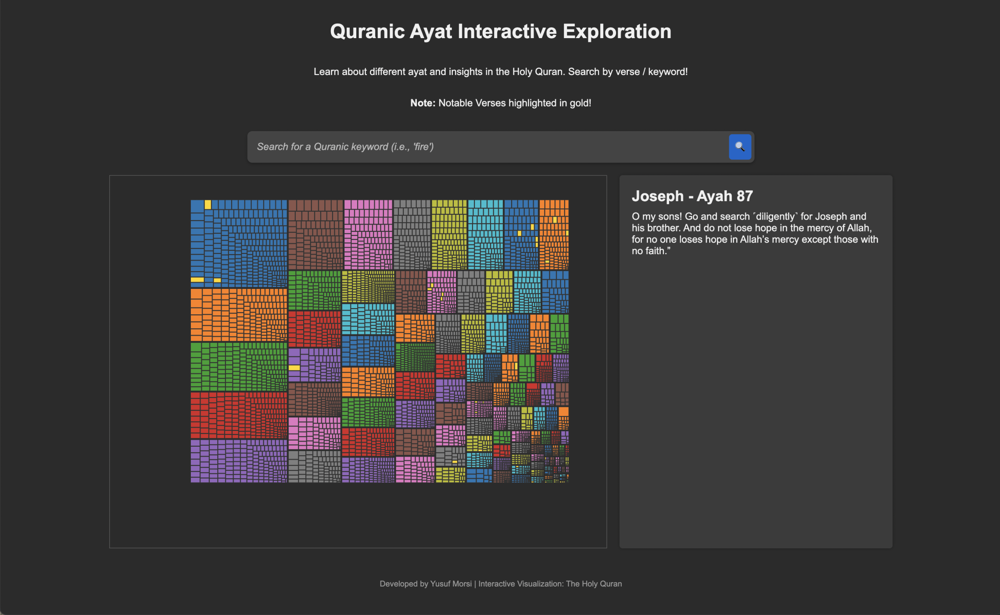

# Quranic Ayat Interactive Exploration

An interactive web visualization tool that allows users to explore and search through verses (ayat) of the Holy Quran using a dynamic treemap visualization built with D3.js.



## Features

- **Interactive Treemap Visualization**: Visual representation of Quranic verses organized by chapters (surahs)
- **Notable Verses Highlighting**: Important verses are highlighted in gold for easy reference
- **Real-time Search**: Dynamic search functionality to find specific verses by keywords
- **Verse Details Panel**: Detailed view of selected verses with English translations
- **Zoom Functionality**: Ability to zoom in/out of the visualization for better exploration
- **Responsive Design**: Clean, modern interface that adapts to different screen sizes

## Prerequisites

- Modern web browser (Chrome, Firefox, Safari, or Edge)
- Local development server or web hosting environment
- Internet connection (for loading D3.js from CDN)

## Installation

1. Clone the repository:
```bash
git clone [repository-url]
cd quranic-visualization
```

2. Ensure you have the required data file:
- Place `TheQuranDataset.json` in your project root directory
- The JSON file should contain the Quranic verses with their translations

3. Set up the project:
- No build process required
- Can be served using any static file server

## Project Structure

```
├── index.html          # Main HTML file
├── script.js           # D3.js visualization code
├── quran.png          # Favicon
└── TheQuranDataset.json # Quranic verses dataset
```

## Usage

1. Start a local server in the project directory:
```bash
# Using Python 3
python -m http.server 8000

# Using Node.js's http-server
npx http-server
```

2. Open your browser and navigate to:
- `http://localhost:8000` (or appropriate port)

3. Interact with the visualization:
- Click on verses to view details
- Use the search bar to find specific content
- Zoom in/out using mouse wheel or touchpad gestures

## Data Structure

The visualization expects a JSON file with the following structure:
```json
{
  "name": "Quran",
  "children": [
    {
      "name": "Surah Name",
      "children": [
        {
          "surah_name_en": "Chapter Name",
          "ayah_no_surah": "Verse Number",
          "ayah_en": "English Translation",
          "value": 1
        }
      ]
    }
  ]
}
```

## Notable Verses

The visualization highlights several important verses in gold, including:
- Ayat al-Kursi (The Cow, 255)
- The last verses of Surah Al-Baqarah (The Cow, 285-286)
- Al-Fatiha (The Opening)
- The Four Quls (The Sincerity, The Dawn, The People)
- Selected verses from other chapters

## Technical Details

### Libraries Used
- D3.js v7.x - For visualization and data handling
- Pure JavaScript - For DOM manipulation and event handling
- CSS3 - For styling and responsive design

### Browser Support
- Chrome (latest)
- Firefox (latest)
- Safari (latest)
- Edge (latest)

## Contributing

Contributions are welcome! Please feel free to submit a Pull Request.

1. Fork the repository
2. Create your feature branch (`git checkout -b feature/AmazingFeature`)
3. Commit your changes (`git commit -m 'Add some AmazingFeature'`)
4. Push to the branch (`git push origin feature/AmazingFeature`)
5. Open a Pull Request

## License

This project is open source and available under the MIT License.

## Acknowledgments

- Creator: Yusuf Morsi
- The Holy Quran text and translations
- D3.js visualization library and community
- Contributors and supporters of Islamic educational tools

## Contact

For questions, suggestions, or issues, please open an issue in the repository or contact the maintainers.